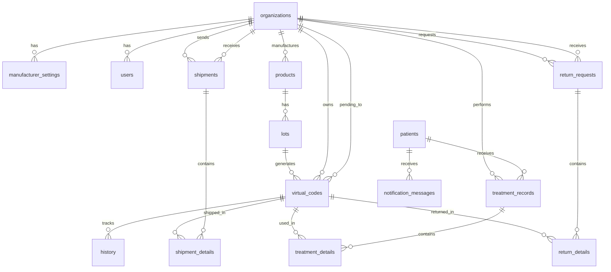

# Database ERD - Neo-Certify System

**Last Updated**: 2025-11-22
**Database Version**: PostgreSQL 17
**Timezone**: Asia/Seoul

## Entity Relationship Diagram



## Table Descriptions

### Core Tables (5)

#### 1. organizations
**Description**: 제조사/유통사/병원 조직 정보
- **Primary Key**: `id` (UUID)
- **Unique**: `business_number`
- **Indexes**: `type`, `status`, `business_number`
- **Statuses**: PENDING_APPROVAL, ACTIVE, INACTIVE, DELETED
- **Types**: MANUFACTURER, DISTRIBUTOR, HOSPITAL

#### 2. users
**Description**: 사용자 프로필 (Supabase Auth 확장)
- **Primary Key**: `id` (UUID, FK to auth.users)
- **Foreign Keys**: `organization_id` → organizations
- **Unique**: `email`
- **Indexes**: `organization_id`, `email`

#### 3. manufacturer_settings
**Description**: 제조사별 Lot 번호 생성 규칙
- **Primary Key**: `id` (UUID)
- **Foreign Keys**: `organization_id` (UNIQUE) → organizations
- **Defaults**: lot_prefix='ND', expiry_months=24

#### 4. products
**Description**: 제품 마스터 데이터
- **Primary Key**: `id` (UUID)
- **Foreign Keys**: `organization_id` → organizations
- **Indexes**: `organization_id`, `is_active`

#### 5. lots
**Description**: 생산 단위 (Lot)
- **Primary Key**: `id` (UUID)
- **Foreign Keys**: `product_id` → products
- **Unique**: `lot_number`
- **Indexes**: `product_id`, `lot_number`, `manufacture_date`

### Tracking Tables (3)

#### 6. virtual_codes ★ Core Tracking Unit
**Description**: 가상 식별코드 (1 Lot → N Virtual Codes)
- **Primary Key**: `id` (UUID)
- **Foreign Keys**:
  - `lot_id` → lots
  - `pending_to` → organizations (nullable)
  - `previous_owner_id` → organizations (nullable)
- **Unique**: `code`
- **Indexes**:
  - `code`
  - `lot_id`
  - `status`
  - `(owner_type, owner_id)`
  - `pending_to` (partial: WHERE pending_to IS NOT NULL)
  - `(lot_id, sequence_number)` for FIFO sorting
  - `previous_owner_id` (partial: WHERE previous_owner_id IS NOT NULL)
- **Statuses**: IN_STOCK, PENDING, USED, DISPOSED
- **Owner Types**: organization, patient
- **Key Fields**:
  - `sequence_number`: FIFO internal sorting order within Lot
  - `previous_owner_id`: For return tracking (ownership restoration)

#### 7. patients
**Description**: 환자 정보 (전화번호 기반)
- **Primary Key**: `phone_number` (VARCHAR(11))
- **Format**: 01012345678 (no hyphens)

#### 8. history
**Description**: 전체 거래 이력 추적
- **Primary Key**: `id` (UUID)
- **Foreign Keys**: `virtual_code_id` → virtual_codes
- **Indexes**: `virtual_code_id`, `action_type`, `created_at DESC`, `(from_owner_type, from_owner_id)`, `(to_owner_type, to_owner_id)`
- **Action Types**: PRODUCTION, SHIPMENT, RECEIVE, TREATMENT, RECALL, RETURN, DISPOSE

### Shipment Tables (2)

#### 9. shipments
**Description**: 출고 기록 (조직 간 제품 이동)
- **Primary Key**: `id` (UUID)
- **Foreign Keys**:
  - `sender_id` → organizations
  - `receiver_id` → organizations
- **Indexes**: `sender_id`, `receiver_id`, `status`, `created_at DESC`
- **Statuses**: PENDING, ACCEPTED, REJECTED, COMPLETED

#### 10. shipment_details
**Description**: 출고 상세 (출고된 virtual_code 목록)
- **Primary Key**: `id` (UUID)
- **Foreign Keys**:
  - `shipment_id` → shipments
  - `virtual_code_id` → virtual_codes
- **Constraint**: UNIQUE(shipment_id, virtual_code_id)

### Treatment Tables (2)

#### 11. treatment_records
**Description**: 시술 기록 (환자별 시술 세션)
- **Primary Key**: `id` (UUID)
- **Foreign Keys**:
  - `hospital_id` → organizations
  - `patient_phone` → patients
- **Indexes**: `hospital_id`, `patient_phone`, `treatment_date DESC`

#### 12. treatment_details
**Description**: 시술 상세 (사용된 virtual_code 목록)
- **Primary Key**: `id` (UUID)
- **Foreign Keys**:
  - `treatment_id` → treatment_records
  - `virtual_code_id` → virtual_codes
- **Constraint**: UNIQUE(treatment_id, virtual_code_id)

### Return Tables (2)

#### 13. return_requests
**Description**: 반품 요청 (유통사↔제조사, 병원↔유통사)
- **Primary Key**: `id` (UUID)
- **Foreign Keys**:
  - `requester_id` → organizations
  - `receiver_id` → organizations
- **Indexes**: `requester_id`, `receiver_id`, `status`, `created_at DESC`
- **Statuses**: PENDING, APPROVED, REJECTED

#### 14. return_details
**Description**: 반품 상세 (반품할 virtual_code 목록)
- **Primary Key**: `id` (UUID)
- **Foreign Keys**:
  - `return_request_id` → return_requests
  - `virtual_code_id` → virtual_codes
- **Constraint**: UNIQUE(return_request_id, virtual_code_id)

### Notification Tables (1)

#### 15. notification_messages
**Description**: 환자 알림 메시지 (인증/회수)
- **Primary Key**: `id` (UUID)
- **Foreign Keys**: `patient_phone` → patients
- **Indexes**: `patient_phone`, `type`, `is_sent`
- **Types**: AUTHENTICATION, RECALL

## Database Functions (RPC)

### 1. generate_unique_virtual_code()
**Purpose**: Generate unique 12-character virtual code (MD5 hash)
**Returns**: VARCHAR(12)

### 2. get_next_lot_number(organization_id UUID)
**Purpose**: Auto-generate next lot number based on manufacturer settings
**Returns**: VARCHAR(50)

### 3. shipment_transaction(shipment_id UUID)
**Purpose**: Atomic shipment creation with virtual code status updates
**Returns**: BOOLEAN

### 4. accept_shipment(shipment_id UUID)
**Purpose**: Accept pending shipment (PENDING → IN_STOCK)
**Returns**: BOOLEAN

### 5. reject_shipment(shipment_id UUID)
**Purpose**: Reject shipment (restore ownership to previous_owner_id)
**Returns**: BOOLEAN

### 6. get_fifo_virtual_codes(org_id UUID, quantity INTEGER)
**Purpose**: Allocate virtual codes using FIFO algorithm
**Sorting**: manufacture_date ASC, expiry_date ASC, sequence_number ASC, created_at ASC
**Returns**: TABLE(virtual_code_id UUID)

### 7. check_recall_eligible(virtual_code_id UUID)
**Purpose**: Check if virtual code can be recalled (24-hour window)
**Returns**: BOOLEAN

## Row Level Security (RLS)

### Enabled on All 15 Tables

**Key Policies** (30 total):
- Organizations (3): View own, Update own, Admin manage all
- Users (4): View colleagues, Update own, Insert own, Admin manage all
- Manufacturer_settings (2): Manage own, Admin view all
- Products (3): View all (public), Insert manufacturer, Update manufacturer
- Lots (3): View owner/admin, Insert manufacturer, Admin view all
- Virtual_codes (4): View owner, View pending, Update owner, Admin view all
- Patients (2): View own treatments, Insert hospital
- History (3): View own org, Insert own org, Admin view all
- Shipments (3): View related parties, Insert own, Admin view all
- Shipment_details (1): View via shipment RLS
- Return_requests (2): View related parties, Insert own
- Return_details (1): View via return_request RLS
- Treatment_records (2): View own hospital, Insert own hospital
- Treatment_details (1): View via treatment_record RLS
- Notification_messages (1): View own patient

## Timezone Configuration

```sql
ALTER DATABASE postgres SET timezone TO 'Asia/Seoul';
```

All `TIMESTAMPTZ` columns automatically use Asia/Seoul timezone.

## Constants Mapping

All table names, column names, and status values are mapped to TypeScript constants in `src/constants/database.ts`, `src/constants/status.ts`, and `src/constants/business-logic.ts` following SSOT principles.

See:
- [TABLES constants](../src/constants/database.ts)
- [COLUMNS constants](../src/constants/database.ts)
- [STATUS constants](../src/constants/status.ts)
- [DB_FUNCTIONS constants](../src/constants/database.ts)
- [RLS_POLICIES constants](../src/constants/database.ts)
