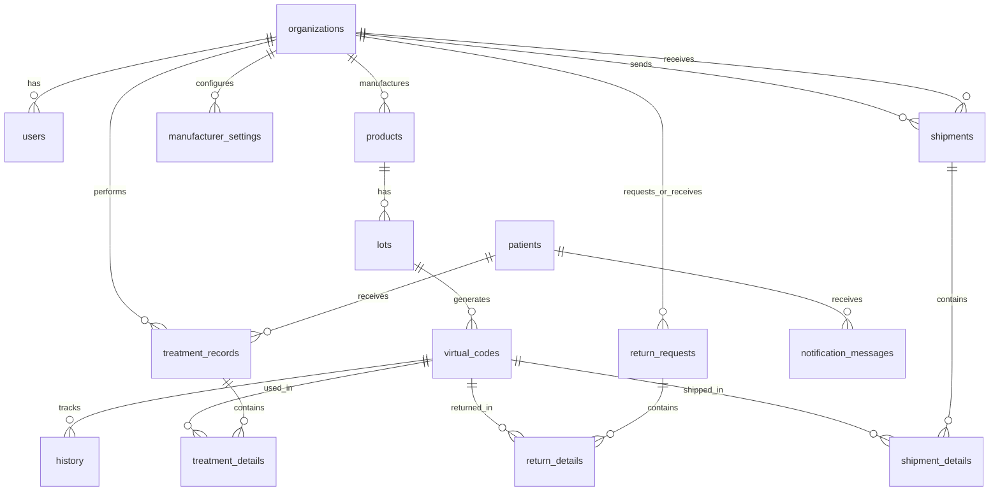

# Phase 1: 데이터베이스 설계 및 구축

## 📋 개요

**목표**: Supabase 전체 스키마 완성 및 RLS 설정
**기간**: 3-5일
**완료 상태**: ✅ 100% 완료 (2025-11-22)

---

## 🎯 개발 원칙 (Development Principles)

이 Phase 작업 시 다음 9가지 개발 원칙을 준수해야 합니다:

### 핵심 원칙
1. **SSOT**: 모든 상수는 `src/constants/`에 정의
2. **No Magic Numbers**: 리터럴 값 금지
3. **No 'any' Type**: TypeScript strict mode
4. **Clean Code**: 명확한 네이밍, 단일 책임
5. **Test-Driven**: 테스트 작성 필수 (커버리지 80%+)
6. **Conventional Commits**: `<type>(<scope>): <subject>`
7. **Frontend-First**: UI 먼저, 백엔드 나중
8. **Complete Task Execution**: 시간 무관 작업 범위 100% 완료 ⭐
9. **Context Memory Alert**: 메모리 부족 시 사용자 알림 ⭐

### 이 Phase 중점 원칙
- **원칙 1 (SSOT)**: 테이블명, 컬럼명 모두 database.ts 상수 사용
- **원칙 8 (범위 완료)**: 모든 제약 조건(NOT NULL, UNIQUE, CHECK) 완벽 검증
- **원칙 8 (범위 완료)**: RLS 정책 30개 완전 구현 및 테스트

**상세 내용**: [DEVELOPMENT_PRINCIPLES.md](../../DEVELOPMENT_PRINCIPLES.md)

---

## 세부 계획 (5개 유닛)

- **[Phase 1.1](phase-1.1-db-design.md)**: 전체 데이터베이스 ERD 설계 및 Supabase 로컬 환경 구축
- **[Phase 1.2](phase-1.2-core-tables.md)**: 핵심 테이블 마이그레이션 (organizations, users, products, lots)
- **[Phase 1.3](phase-1.3-relations-tables.md)**: 관계 테이블 마이그레이션 (virtual_codes, history, treatments, returns)
- **[Phase 1.4](phase-1.4-rls-policies.md)**: RLS 정책 설정 (조직별 데이터 격리)
- **[Phase 1.5](phase-1.5-storage-setup.md)**: Supabase Storage 설정 (사업자등록증 파일)

---

## 데이터베이스 구조

### 핵심 테이블 (15개)

#### 1. 조직 및 사용자 (3개)
- **organizations**: 제조사/유통사/병원 정보
- **users**: 사용자 프로필 (Supabase Auth 확장)
- **manufacturer_settings**: 제조사별 Lot 번호 생성 규칙

#### 2. 제품 및 Lot (2개)
- **products**: 제품 마스터 정보
- **lots**: Lot (생산 단위) 정보

#### 3. 가상 식별코드 및 이력 (3개)
- **virtual_codes**: 가상 식별코드 (★ 핵심 추적 단위)
- **patients**: 환자 정보 (전화번호 기반)
- **history**: 이력 추적 (모든 거래 기록)

#### 4. 출고 관련 (2개)
- **shipments**: 출고 기록 (조직 간 제품 이동)
- **shipment_details**: 출고 상세 (출고되는 virtual_code 목록)

#### 5. 시술 관련 (2개)
- **treatment_records**: 시술 기록
- **treatment_details**: 시술 상세 (사용된 virtual_code 목록)

#### 6. 반품 관련 (2개)
- **return_requests**: 반품 요청
- **return_details**: 반품 상세 (반품할 virtual_code 목록)

#### 7. 알림 (1개)
- **notification_messages**: 알림 메시지 (환자 인증/회수)

---

## ERD 관계도



---

## RLS 정책 개요

### 핵심 원칙

1. **조직별 격리**: 각 조직은 자신의 데이터만 접근
2. **PENDING 데이터**: 수신자는 승인 전에도 조회 가능
3. **환자 데이터**: 시술한 병원만 접근
4. **관리자 접근**: 모든 데이터 조회 가능 (organization_id IS NULL)

### Helper 함수

```sql
-- 현재 사용자의 organization_id 반환
public.user_organization_id()

-- 현재 사용자가 관리자인지 확인
public.is_admin()
```

### 정책 예시

```sql
-- Organizations can view their own data
CREATE POLICY "Organizations can view own data"
  ON products FOR SELECT
  USING (
    organization_id = public.user_organization_id()
    OR public.is_admin()
  );

-- Receivers can view PENDING virtual_codes
CREATE POLICY "Organizations can view pending virtual_codes"
  ON virtual_codes FOR SELECT
  USING (
    status = 'PENDING' AND pending_to = public.user_organization_id()
  );
```

---

## Storage 구조

### 버킷

- **business-licenses** (private): 사업자등록증 파일 저장

### 파일 경로 규칙

```
{organization_id}/{timestamp}_{filename}

예시:
550e8400-e29b-41d4-a716-446655440000/1705747200000_business_license.pdf
```

### Storage RLS 정책

- Organizations can upload/view/update/delete own files
- Admins can view all files
- Max file size: 10MB
- Allowed types: PDF, JPG, PNG

---

## 마이그레이션 파일 목록

```
supabase/migrations/
├── [timestamp]_create_core_tables.sql        # Phase 1.2
├── [timestamp]_create_relations_tables.sql   # Phase 1.3
├── [timestamp]_enable_rls_policies.sql       # Phase 1.4
└── [timestamp]_create_storage_buckets.sql    # Phase 1.5
```

---

## TypeScript 타입 생성

Phase 1 완료 후 실행:

```bash
# 로컬 DB에서 TypeScript 타입 자동 생성
supabase gen types typescript --local > src/types/database.ts
```

생성되는 타입:

```typescript
export interface Database {
  public: {
    Tables: {
      organizations: { Row, Insert, Update }
      users: { Row, Insert, Update }
      // ... 모든 테이블
    }
  }
}
```

---

## 테스트 요구사항

### 각 Phase별 테스트

- **Phase 1.2**: 제약 조건 테스트 (5개 시나리오)
- **Phase 1.3**: 관계 테스트 (6개 시나리오)
- **Phase 1.4**: RLS 정책 테스트 (Application-level)
- **Phase 1.5**: Storage 업로드/다운로드 테스트

### 수동 검증

```bash
# 1. 테이블 존재 확인
psql $(supabase status | grep 'DB URL' | awk '{print $3}') -c "\dt"

# 2. RLS 활성화 확인
psql $(supabase status | grep 'DB URL' | awk '{print $3}') -c "
SELECT tablename, rowsecurity FROM pg_tables WHERE schemaname='public';
"

# 3. Storage 버킷 확인
# Studio → Storage → business-licenses 존재 확인
```

---

## 완료 기준

- ✅ ERD 다이어그램 작성 완료
- ✅ 13개 테이블 마이그레이션 작성 완료
- ✅ 모든 인덱스 및 제약 조건 설정 완료
- ✅ RLS 정책 설정 완료 (all 13 tables)
- ✅ Storage 버킷 및 RLS 설정 완료
- ✅ TypeScript 타입 생성 준비 완료
- ⏳ 로컬 DB 적용 (실제 개발 시)
- ⏳ 테스트 검증 (실제 개발 시)

---

## Git Commit 이력 (예상)

```
feat(db): Initialize Supabase local environment
docs(db): Add database ERD diagram
feat(db): Create core tables migration
feat(db): Create relations tables migration
feat(db): Enable RLS policies for all tables
feat(storage): Setup business license storage bucket
```

---

## 주요 학습 포인트

### 1. Supabase Migrations
- CLI 기반 마이그레이션 관리
- 로컬 Docker 환경에서 검증 후 Cloud 적용
- Rollback 전략

### 2. RLS (Row Level Security)
- PostgreSQL native 기능
- Application-level 보안보다 안전
- Organization-based multi-tenancy 구현

### 3. Storage with RLS
- 파일도 RLS로 보호
- Signed URL로 안전한 다운로드
- Organization 폴더 격리

---

## 다음 단계

**Phase 1 완료!**

다음: [Phase 2 - 인증 및 UI 프레임워크](../phase-2/)

**작업 내용**:
- Supabase Auth 통합
- 로그인/회원가입 UI
- 역할 기반 레이아웃
- Protected Routes
