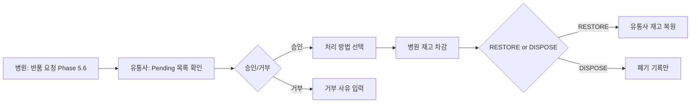

# Phase 4.4: 반품 처리 (유통사)

## 📋 Overview

**Phase 4.4**는 유통사의 반품 처리 기능을 구현합니다:

1. **병원 반품 요청 승인/거부** (Phase 5.6에서 생성된 return_requests 처리)
2. **승인 시**: 병원 재고 차감 → 유통사 재고 복원 또는 폐기

**PRD 참조**:
- Section 10: 반품 프로세스
- Section 10.2: 유통사 반품 승인/거부

**예상 소요 시간**: 1-2일

---

## 🎯 핵심 요구사항

### 1. 반품 승인/거부 플로우



---

## 🎯 Development Principles Checklist

- [ ] **SSOT (Single Source of Truth)**: 모든 리터럴은 constants에서 관리
- [ ] **No Magic Numbers**: 하드코딩된 숫자 없이 상수 사용
- [ ] **No 'any' Type**: 모든 타입을 명시적으로 정의
- [ ] **Clean Code**: 함수는 단일 책임, 명확한 변수명
- [ ] **Test-Driven Development**: 테스트 시나리오 우선 작성
- [ ] **Git Conventional Commits**: feat/fix/docs/test 등 규칙 준수
- [ ] **Frontend-First Development**: API 호출 전 타입 및 인터페이스 정의
- [ ] 원칙 8: 작업 범위 100% 완료 (시간 무관)
- [ ] 원칙 9: Context 메모리 부족 시 사용자 알림

---

### 2. return_requests 테이블 (Phase 1.3)

**상태 전이**:
- `PENDING` → `APPROVED` (승인)
- `PENDING` → `REJECTED` (거부)

---

## 📦 Work Content

### DistributorReturnsPage 컴포넌트

**파일 경로**: `src/pages/distributor/DistributorReturnsPage.tsx`

```typescript
import { useState } from 'react'
import { useQuery, useMutation, useQueryClient } from '@tanstack/react-query'
import { supabase } from '@/lib/supabase'
import { useAuth } from '@/contexts/AuthContext'
import { useToast } from '@/hooks/use-toast'
import { Button } from '@/components/ui/button'
import { Textarea } from '@/components/ui/textarea'
import {
  Select,
  SelectContent,
  SelectItem,
  SelectTrigger,
  SelectValue,
} from '@/components/ui/select'
import {
  Table,
  TableBody,
  TableCell,
  TableHead,
  TableHeader,
  TableRow,
} from '@/components/ui/table'
import {
  Dialog,
  DialogContent,
  DialogHeader,
  DialogTitle,
  DialogFooter,
} from '@/components/ui/dialog'
import { Badge } from '@/components/ui/badge'
import { Card, CardContent, CardHeader, CardTitle } from '@/components/ui/card'
import { Tabs, TabsContent, TabsList, TabsTrigger } from '@/components/ui/tabs'
import { SUCCESS_MESSAGES, ERROR_MESSAGES } from '@/constants/messages'
import { VALIDATION } from '@/constants/validation'
import { format } from 'date-fns'

type ReturnAction = 'RESTORE' | 'DISPOSE'

/**
 * Phase 1.3 아키텍처:
 * - return_requests 테이블: lot_id, quantity 컬럼 없음
 * - return_details 테이블: virtual_code_id 목록 (N개 레코드)
 */
interface ReturnRequest {
  id: string
  requester_id: string
  receiver_id: string
  reason: string
  status: 'PENDING' | 'APPROVED' | 'REJECTED'
  action?: ReturnAction
  requested_at: string
  processed_by?: string
  processed_at?: string
  reject_reason?: string
  requester: {
    name: string
  }
}

interface ReturnDetail {
  id: string
  return_request_id: string
  virtual_code_id: string
  virtual_code: {
    code: string
    lot: {
      lot_number: string
      product: {
        name: string
      }
    }
  }
}

export function DistributorReturnsPage() {
  const { user } = useAuth()
  const { toast } = useToast()
  const queryClient = useQueryClient()

  const [isApproveDialogOpen, setIsApproveDialogOpen] = useState(false)
  const [isRejectDialogOpen, setIsRejectDialogOpen] = useState(false)
  const [selectedRequest, setSelectedRequest] = useState<ReturnRequest | null>(null)
  const [returnAction, setReturnAction] = useState<ReturnAction>('RESTORE')
  const [rejectReason, setRejectReason] = useState('')

  // Get user's organization_id
  const { data: userData } = useQuery({
    queryKey: ['userData', user?.id],
    queryFn: async () => {
      const { data, error } = await supabase
        .from('users')
        .select('organization_id')
        .eq('id', user!.id)
        .single()

      if (error) throw error
      return data
    },
    enabled: !!user,
  })

  // Fetch return requests with details
  const { data: returnRequests } = useQuery({
    queryKey: ['distributorReturnRequests', userData?.organization_id],
    queryFn: async () => {
      // 1. Fetch return_requests
      const { data: requests, error: requestsError } = await supabase
        .from('return_requests')
        .select('*, requester:organizations!requester_id(name)')
        .eq('receiver_id', userData!.organization_id)
        .order('requested_at', { ascending: false })

      if (requestsError) throw requestsError

      // 2. Fetch return_details for each request
      const requestsWithDetails = await Promise.all(
        requests.map(async (req) => {
          const { data: details, error: detailsError } = await supabase
            .from('return_details')
            .select(`
              *,
              virtual_code:virtual_codes(
                code,
                lot:lots(lot_number, product:products(name))
              )
            `)
            .eq('return_request_id', req.id)

          if (detailsError) throw detailsError

          return {
            ...req,
            details: details as ReturnDetail[],
            quantity: details.length, // Virtual Code 개수
          }
        })
      )

      return requestsWithDetails
    },
    enabled: !!userData,
  })

  // Approve return request mutation
  const approveReturnMutation = useMutation({
    mutationFn: async ({ requestId, action }: { requestId: string; action: ReturnAction }) => {
      const request = returnRequests?.find((r) => r.id === requestId)
      if (!request) throw new Error('요청을 찾을 수 없습니다.')

      /**
       * Phase 1.3 아키텍처:
       * - return_details에서 virtual_code_id 목록 조회
       * - Virtual Code 소유권 복원 (previous_owner_id 활용)
       */

      // 1. Fetch return_details (Virtual Code 목록)
      const { data: returnDetails, error: detailsError } = await supabase
        .from('return_details')
        .select('virtual_code_id')
        .eq('return_request_id', requestId)

      if (detailsError) throw detailsError
      if (!returnDetails || returnDetails.length === 0) {
        throw new Error('반품 상세 정보를 찾을 수 없습니다.')
      }

      const virtualCodeIds = returnDetails.map(d => d.virtual_code_id)

      // 2. Update return_request status
      const { error: updateError } = await supabase
        .from('return_requests')
        .update({
          status: 'APPROVED',
          action: action,
          processed_by: user!.id,
          processed_at: new Date().toISOString(),
        })
        .eq('id', requestId)

      if (updateError) throw updateError

      // 3. Update Virtual Code ownership
      if (action === 'RESTORE') {
        // RESTORE: 유통사로 소유권 복원 (previous_owner_id 활용)
        const { data: virtualCodes, error: vcFetchError } = await supabase
          .from('virtual_codes')
          .select('previous_owner_id')
          .in('id', virtualCodeIds)

        if (vcFetchError) throw vcFetchError

        const previousOwnerId = virtualCodes[0]?.previous_owner_id
        if (!previousOwnerId) {
          throw new Error('이전 소유자 정보가 없습니다.')
        }

        // 소유권 복원
        const { error: restoreError } = await supabase
          .from('virtual_codes')
          .update({
            status: 'IN_STOCK',
            owner_id: previousOwnerId,  // 유통사로 복원
            previous_owner_id: null,
            pending_to: null,
          })
          .in('id', virtualCodeIds)

        if (restoreError) throw restoreError
      } else {
        // DISPOSE: 폐기 상태로 변경
        const { error: disposeError } = await supabase
          .from('virtual_codes')
          .update({
            status: 'DISPOSED',
          })
          .in('id', virtualCodeIds)

        if (disposeError) throw disposeError
      }

      // 4. History 기록
      const historyRecords = virtualCodeIds.map(vcId => ({
        virtual_code_id: vcId,
        action_type: action === 'RESTORE' ? 'RETURN' : 'DISPOSE',
        from_owner_type: 'organization',
        from_owner_id: request.requester_id,  // 병원
        to_owner_type: 'organization',
        to_owner_id: action === 'RESTORE' ? userData!.organization_id : null,
      }))

      const { error: historyError } = await supabase
        .from('history')
        .insert(historyRecords)

      if (historyError) throw historyError
    },
    onSuccess: () => {
      queryClient.invalidateQueries({ queryKey: ['distributorReturnRequests'] })
      queryClient.invalidateQueries({ queryKey: ['inventory'] })
      toast({
        title: SUCCESS_MESSAGES.RETURN_REQUEST.APPROVED,
        description: `처리 방법: ${returnAction === 'RESTORE' ? '재고 복원' : '폐기'}`,
      })
      setIsApproveDialogOpen(false)
      setSelectedRequest(null)
    },
    onError: (error) => {
      toast({
        title: ERROR_MESSAGES.RETURN_REQUEST.APPROVE_FAILED,
        description: error instanceof Error ? error.message : ERROR_MESSAGES.GENERAL.UNEXPECTED,
        variant: 'destructive',
      })
    },
  })

  // Reject return request mutation
  const rejectReturnMutation = useMutation({
    mutationFn: async ({ requestId, reason }: { requestId: string; reason: string }) => {
      if (!reason || reason.trim().length < VALIDATION.RETURN_REASON_MIN_LENGTH) {
        throw new Error(`거부 사유를 ${VALIDATION.RETURN_REASON_MIN_LENGTH}자 이상 입력해주세요.`)
      }

      const { error } = await supabase
        .from('return_requests')
        .update({
          status: 'REJECTED',
          reject_reason: reason.trim(),
          processed_by: user!.id,
          processed_at: new Date().toISOString(),
        })
        .eq('id', requestId)

      if (error) throw error
    },
    onSuccess: () => {
      queryClient.invalidateQueries({ queryKey: ['distributorReturnRequests'] })
      toast({ title: SUCCESS_MESSAGES.RETURN_REQUEST.REJECTED })
      setIsRejectDialogOpen(false)
      setSelectedRequest(null)
      setRejectReason('')
    },
    onError: (error) => {
      toast({
        title: ERROR_MESSAGES.RETURN_REQUEST.REJECT_FAILED,
        description: error instanceof Error ? error.message : ERROR_MESSAGES.GENERAL.UNEXPECTED,
        variant: 'destructive',
      })
    },
  })

  const handleApproveClick = (request: ReturnRequest) => {
    setSelectedRequest(request)
    setIsApproveDialogOpen(true)
    setReturnAction('RESTORE')
  }

  const handleRejectClick = (request: ReturnRequest) => {
    setSelectedRequest(request)
    setIsRejectDialogOpen(true)
    setRejectReason('')
  }

  const pendingRequests = returnRequests?.filter((r) => r.status === 'PENDING') || []
  const processedRequests = returnRequests?.filter((r) => r.status !== 'PENDING') || []

  return (
    <div className="space-y-6">
      <div>
        <h1 className="text-2xl font-bold text-gray-900">반품 처리</h1>
        <p className="mt-1 text-sm text-gray-600">병원 반품 요청을 승인/거부합니다</p>
      </div>

      <Tabs defaultValue="pending">
        <TabsList>
          <TabsTrigger value="pending">
            대기중 ({pendingRequests.length})
          </TabsTrigger>
          <TabsTrigger value="processed">
            처리 완료 ({processedRequests.length})
          </TabsTrigger>
        </TabsList>

        {/* Pending Requests Tab */}
        <TabsContent value="pending">
          <Card>
            <CardHeader>
              <CardTitle>대기중인 반품 요청</CardTitle>
            </CardHeader>
            <CardContent>
              <Table>
                <TableHeader>
                  <TableRow>
                    <TableHead>요청일</TableHead>
                    <TableHead>병원</TableHead>
                    <TableHead>제품</TableHead>
                    <TableHead>Lot 번호</TableHead>
                    <TableHead>수량</TableHead>
                    <TableHead>사유</TableHead>
                    <TableHead>처리</TableHead>
                  </TableRow>
                </TableHeader>
                <TableBody>
                  {pendingRequests.length === 0 ? (
                    <TableRow>
                      <TableCell colSpan={7} className="text-center h-32">
                        대기중인 반품 요청이 없습니다
                      </TableCell>
                    </TableRow>
                  ) : (
                    pendingRequests.map((request) => (
                      <TableRow key={request.id}>
                        <TableCell>
                          {format(new Date(request.requested_at), 'yyyy-MM-dd HH:mm')}
                        </TableCell>
                        <TableCell className="font-medium">
                          {request.requester.name}
                        </TableCell>
                        <TableCell>{request.lot.product.name}</TableCell>
                        <TableCell className="font-mono text-sm">
                          {request.lot.lot_number}
                        </TableCell>
                        <TableCell>{request.quantity}개</TableCell>
                        <TableCell className="text-sm text-gray-600 max-w-xs truncate">
                          {request.reason}
                        </TableCell>
                        <TableCell>
                          <div className="flex gap-2">
                            <Button
                              size="sm"
                              onClick={() => handleApproveClick(request)}
                            >
                              승인
                            </Button>
                            <Button
                              size="sm"
                              variant="destructive"
                              onClick={() => handleRejectClick(request)}
                            >
                              거부
                            </Button>
                          </div>
                        </TableCell>
                      </TableRow>
                    ))
                  )}
                </TableBody>
              </Table>
            </CardContent>
          </Card>
        </TabsContent>

        {/* Processed Requests Tab */}
        <TabsContent value="processed">
          <Card>
            <CardHeader>
              <CardTitle>처리 완료된 반품 요청</CardTitle>
            </CardHeader>
            <CardContent>
              <Table>
                <TableHeader>
                  <TableRow>
                    <TableHead>요청일</TableHead>
                    <TableHead>병원</TableHead>
                    <TableHead>제품</TableHead>
                    <TableHead>수량</TableHead>
                    <TableHead>상태</TableHead>
                    <TableHead>처리 방법</TableHead>
                    <TableHead>처리일</TableHead>
                  </TableRow>
                </TableHeader>
                <TableBody>
                  {processedRequests.length === 0 ? (
                    <TableRow>
                      <TableCell colSpan={7} className="text-center h-32">
                        처리된 반품 요청이 없습니다
                      </TableCell>
                    </TableRow>
                  ) : (
                    processedRequests.map((request) => (
                      <TableRow key={request.id}>
                        <TableCell>
                          {format(new Date(request.requested_at), 'yyyy-MM-dd HH:mm')}
                        </TableCell>
                        <TableCell>{request.requester.name}</TableCell>
                        <TableCell>{request.lot.product.name}</TableCell>
                        <TableCell>{request.quantity}개</TableCell>
                        <TableCell>
                          <Badge
                            className={
                              request.status === 'APPROVED'
                                ? 'bg-green-100 text-green-800'
                                : 'bg-red-100 text-red-800'
                            }
                          >
                            {request.status === 'APPROVED' ? '승인됨' : '거부됨'}
                          </Badge>
                        </TableCell>
                        <TableCell>
                          {request.status === 'APPROVED' && request.action ? (
                            <Badge variant="secondary">
                              {request.action === 'RESTORE' ? '재고 복원' : '폐기'}
                            </Badge>
                          ) : (
                            <span className="text-sm text-gray-400">-</span>
                          )}
                        </TableCell>
                        <TableCell>
                          {request.processed_at
                            ? format(new Date(request.processed_at), 'yyyy-MM-dd HH:mm')
                            : '-'}
                        </TableCell>
                      </TableRow>
                    ))
                  )}
                </TableBody>
              </Table>
            </CardContent>
          </Card>
        </TabsContent>
      </Tabs>

      {/* Approve Dialog */}
      <Dialog open={isApproveDialogOpen} onOpenChange={setIsApproveDialogOpen}>
        <DialogContent>
          <DialogHeader>
            <DialogTitle>반품 승인</DialogTitle>
          </DialogHeader>
          {selectedRequest && (
            <div className="space-y-4">
              <div className="rounded-lg border bg-gray-50 p-4 space-y-2">
                <div className="text-sm">
                  <span className="font-semibold">병원:</span> {selectedRequest.requester.name}
                </div>
                <div className="text-sm">
                  <span className="font-semibold">제품:</span> {selectedRequest.lot.product.name}
                </div>
                <div className="text-sm">
                  <span className="font-semibold">수량:</span> {selectedRequest.quantity}개
                </div>
                <div className="text-sm">
                  <span className="font-semibold">사유:</span> {selectedRequest.reason}
                </div>
              </div>

              <div>
                <label className="text-sm font-medium">처리 방법 *</label>
                <Select value={returnAction} onValueChange={(v) => setReturnAction(v as ReturnAction)}>
                  <SelectTrigger className="mt-1.5">
                    <SelectValue />
                  </SelectTrigger>
                  <SelectContent>
                    <SelectItem value="RESTORE">재고 복원 (유통사 재고에 추가)</SelectItem>
                    <SelectItem value="DISPOSE">폐기 (재고에 추가하지 않음)</SelectItem>
                  </SelectContent>
                </Select>
                <p className="mt-1.5 text-xs text-gray-600">
                  {returnAction === 'RESTORE'
                    ? '유통사 재고에 반품된 수량이 추가됩니다.'
                    : '반품된 제품은 폐기 처리되며 재고에 추가되지 않습니다.'}
                </p>
              </div>
            </div>
          )}
          <DialogFooter>
            <Button variant="outline" onClick={() => setIsApproveDialogOpen(false)}>
              취소
            </Button>
            <Button
              onClick={() => {
                if (selectedRequest) {
                  approveReturnMutation.mutate({
                    requestId: selectedRequest.id,
                    action: returnAction,
                  })
                }
              }}
              disabled={approveReturnMutation.isPending}
            >
              {approveReturnMutation.isPending ? '처리 중...' : '승인'}
            </Button>
          </DialogFooter>
        </DialogContent>
      </Dialog>

      {/* Reject Dialog */}
      <Dialog open={isRejectDialogOpen} onOpenChange={setIsRejectDialogOpen}>
        <DialogContent>
          <DialogHeader>
            <DialogTitle>반품 거부</DialogTitle>
          </DialogHeader>
          {selectedRequest && (
            <div className="space-y-4">
              <div className="rounded-lg border bg-gray-50 p-4 space-y-2">
                <div className="text-sm">
                  <span className="font-semibold">병원:</span> {selectedRequest.requester.name}
                </div>
                <div className="text-sm">
                  <span className="font-semibold">제품:</span> {selectedRequest.lot.product.name}
                </div>
                <div className="text-sm">
                  <span className="font-semibold">수량:</span> {selectedRequest.quantity}개
                </div>
              </div>

              <div>
                <label className="text-sm font-medium">거부 사유 (최소 5자) *</label>
                <Textarea
                  value={rejectReason}
                  onChange={(e) => setRejectReason(e.target.value)}
                  placeholder="예: 반품 조건에 맞지 않습니다."
                  rows={4}
                  className="mt-1.5"
                  maxLength={200}
                />
                <div className="mt-1 text-xs text-gray-500">
                  {rejectReason.length}/200자 (최소 5자)
                </div>
              </div>
            </div>
          )}
          <DialogFooter>
            <Button variant="outline" onClick={() => setIsRejectDialogOpen(false)}>
              취소
            </Button>
            <Button
              variant="destructive"
              onClick={() => {
                if (selectedRequest) {
                  rejectReturnMutation.mutate({
                    requestId: selectedRequest.id,
                    reason: rejectReason,
                  })
                }
              }}
              disabled={!rejectReason.trim() || rejectReason.trim().length < 5 || rejectReturnMutation.isPending}
            >
              {rejectReturnMutation.isPending ? '처리 중...' : '거부'}
            </Button>
          </DialogFooter>
        </DialogContent>
      </Dialog>
    </div>
  )
}
```

---

## 🔧 Constants Definitions

**파일 경로**: `src/constants/messages.ts` (추가)

```typescript
export const SUCCESS_MESSAGES = {
  // ... 기존
  RETURN_REQUEST: {
    APPROVED: '반품 요청이 승인되었습니다.',
    REJECTED: '반품 요청이 거부되었습니다.',
  },
} as const

export const ERROR_MESSAGES = {
  // ... 기존
  RETURN_REQUEST: {
    APPROVE_FAILED: '반품 승인에 실패했습니다.',
    REJECT_FAILED: '반품 거부에 실패했습니다.',
  },
} as const
```

---

## ✅ Definition of Done

### 코드 구현
- [ ] `DistributorReturnsPage.tsx` 생성
- [ ] return_requests 조회 (receiver_id = 유통사)
- [ ] Pending/Processed 탭 분리
- [ ] 승인 처리 (RESTORE/DISPOSE 선택)
- [ ] 거부 처리 (거부 사유 입력)
- [ ] 병원 재고 차감 로직
- [ ] 유통사 재고 복원/폐기 로직

### UI/UX
- [ ] Pending 요청 목록 테이블
- [ ] 승인/거부 버튼
- [ ] 승인 Dialog (처리 방법 선택)
- [ ] 거부 Dialog (사유 입력)
- [ ] 처리 완료 목록 (상태별 Badge)

### 검증
- [ ] 승인 시 병원 재고 차감 확인
- [ ] RESTORE 선택 시 유통사 재고 증가 확인
- [ ] DISPOSE 선택 시 disposals 테이블 INSERT 확인
- [ ] 거부 시 병원 재고 유지 확인

### 문서화
- [ ] 반품 플로우 다이어그램
- [ ] Phase 5.6과 연계 설명
- [ ] PRD Section 10 요구사항 충족 확인

---

## 🔗 관련 문서

- [Phase 5.6: 병원 반품 요청](../phase-5/phase-5.6-hospital-return.md)
- [Phase 1.3: return_requests 테이블](../phase-1/phase-1.3-relations-tables.md)
- [PRD Section 10: 반품 프로세스](../../neo-cert-prd-1.2.md#10-반품-프로세스)

---

## ⏭️ Next Steps

**다음 단계**: [Phase 4.5 - 거래 이력 조회](phase-4.5-distributor-history.md)
