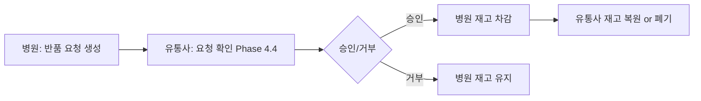

# Phase 5.6: 병원 반품 요청

## 📋 Overview

**Phase 5.6**은 병원이 유통사에게 반품 요청을 생성하는 기능을 구현합니다. 유통사는 Phase 4.4에서 요청을 승인/거부합니다.

**PRD 참조**:
- Section 10: 반품 프로세스
- Section 10.1: 병원→유통사 반품 요청

**예상 소요 시간**: 1일

---

## 🎯 핵심 요구사항

### 1. 반품 플로우



---

## 🎯 Development Principles Checklist

- [ ] **SSOT (Single Source of Truth)**: 모든 리터럴은 constants에서 관리
- [ ] **No Magic Numbers**: 하드코딩된 숫자 없이 상수 사용
- [ ] **No 'any' Type**: 모든 타입을 명시적으로 정의
- [ ] **Clean Code**: 함수는 단일 책임, 명확한 변수명
- [ ] **Test-Driven Development**: 테스트 시나리오 우선 작성
- [ ] **Git Conventional Commits**: feat/fix/docs/test 등 규칙 준수
- [ ] **Frontend-First Development**: API 호출 전 타입 및 인터페이스 정의
- [ ] 원칙 8: 작업 범위 100% 완료 (시간 무관)
- [ ] 원칙 9: Context 메모리 부족 시 사용자 알림

---

### 2. return_requests 테이블 (Phase 1.3에서 정의됨)

**사용 테이블**: `return_requests`

```sql
CREATE TABLE return_requests (
  id UUID PRIMARY KEY DEFAULT uuid_generate_v4(),
  requester_id UUID NOT NULL REFERENCES organizations(id), -- 병원
  receiver_id UUID NOT NULL REFERENCES organizations(id),  -- 유통사
  lot_id UUID NOT NULL REFERENCES lots(id),
  quantity INTEGER NOT NULL CHECK (quantity > 0),
  reason TEXT NOT NULL,
  status TEXT DEFAULT 'PENDING' CHECK (status IN ('PENDING', 'APPROVED', 'REJECTED')),
  action TEXT CHECK (action IN ('RESTORE', 'DISPOSE')), -- 승인 시 유통사가 선택
  requested_by UUID NOT NULL REFERENCES users(id),
  requested_at TIMESTAMPTZ DEFAULT NOW(),
  processed_by UUID REFERENCES users(id),
  processed_at TIMESTAMPTZ,
  reject_reason TEXT,
  created_at TIMESTAMPTZ DEFAULT NOW(),
  updated_at TIMESTAMPTZ DEFAULT NOW()
);
```

---

## 📦 Work Content

### HospitalReturnRequestPage 컴포넌트

**파일 경로**: `src/pages/hospital/HospitalReturnRequestPage.tsx`

```typescript
import { useState } from 'react'
import { useForm } from 'react-hook-form'
import { zodResolver } from '@hookform/resolvers/zod'
import { z } from 'zod'
import { useQuery, useMutation, useQueryClient } from '@tanstack/react-query'
import { supabase } from '@/lib/supabase'
import { useAuth } from '@/contexts/AuthContext'
import { useToast } from '@/hooks/use-toast'
import { Button } from '@/components/ui/button'
import { Input } from '@/components/ui/input'
import { Textarea } from '@/components/ui/textarea'
import {
  Table,
  TableBody,
  TableCell,
  TableHead,
  TableHeader,
  TableRow,
} from '@/components/ui/table'
import {
  Dialog,
  DialogContent,
  DialogHeader,
  DialogTitle,
  DialogFooter,
} from '@/components/ui/dialog'
import { Badge } from '@/components/ui/badge'
import { Card, CardContent, CardHeader, CardTitle } from '@/components/ui/card'
import { SUCCESS_MESSAGES, ERROR_MESSAGES } from '@/constants/messages'

const returnRequestSchema = z.object({
  virtual_code: z.string().length(12, 'Virtual Code는 12자리여야 합니다.'),
  quantity: z.number().min(1, '수량은 1개 이상이어야 합니다.'),
  reason: z.string().min(10, '반품 사유를 10자 이상 입력해주세요.').max(500),
})

type ReturnRequestFormData = z.infer<typeof returnRequestSchema>

export function HospitalReturnRequestPage() {
  const { user } = useAuth()
  const { toast } = useToast()
  const queryClient = useQueryClient()
  const [isCreateDialogOpen, setIsCreateDialogOpen] = useState(false)
  const [verifiedLot, setVerifiedLot] = useState<any>(null)

  const form = useForm<ReturnRequestFormData>({
    resolver: zodResolver(returnRequestSchema),
    defaultValues: {
      virtual_code: '',
      quantity: 1,
      reason: '',
    },
  })

  const virtualCode = form.watch('virtual_code')

  // Get user's organization_id
  const { data: userData } = useQuery({
    queryKey: ['userData', user?.id],
    queryFn: async () => {
      const { data, error } = await supabase
        .from('users')
        .select('organization_id, organizations(*)')
        .eq('id', user!.id)
        .single()

      if (error) throw error
      return data
    },
    enabled: !!user,
  })

  // Verify virtual code and fetch lot info
  const { data: lotData } = useQuery({
    queryKey: ['verifyLot', virtualCode],
    queryFn: async () => {
      const { data, error } = await supabase
        .from('lots')
        .select('*, product:products(*)')
        .eq('virtual_code', virtualCode)
        .single()

      if (error) throw error

      // Check if hospital has this lot in inventory
      const { data: inventoryData, error: invError } = await supabase
        .from('inventory')
        .select('*')
        .eq('lot_id', data.id)
        .eq('organization_id', userData!.organization_id)
        .single()

      if (invError || !inventoryData) {
        throw new Error('병원 재고에 없는 제품입니다.')
      }

      return { lot: data, inventory: inventoryData }
    },
    enabled: virtualCode.length === 12 && !!userData,
  })

  // Fetch existing return requests
  const { data: returnRequests } = useQuery({
    queryKey: ['hospitalReturnRequests', userData?.organization_id],
    queryFn: async () => {
      const { data, error } = await supabase
        .from('return_requests')
        .select('*, lot:lots(*, product:products(*)), receiver:organizations!receiver_id(*)')
        .eq('requester_id', userData!.organization_id)
        .order('created_at', { ascending: false })

      if (error) throw error
      return data
    },
    enabled: !!userData,
  })

  // Create return request mutation
  const createReturnRequestMutation = useMutation({
    mutationFn: async (data: ReturnRequestFormData) => {
      if (!lotData) throw new Error('제품 정보를 먼저 확인해주세요.')

      // Verify quantity
      if (data.quantity > lotData.inventory.current_quantity) {
        throw new Error(
          `재고 부족 (요청: ${data.quantity}, 가용: ${lotData.inventory.current_quantity})`
        )
      }

      // Find distributor (from shipment history)
      const { data: shipmentData, error: shipmentError } = await supabase
        .from('shipment_items')
        .select('shipment_id, shipments!inner(from_organization_id)')
        .eq('lot_id', lotData.lot.id)
        .order('created_at', { ascending: false })
        .limit(1)
        .single()

      if (shipmentError || !shipmentData) {
        throw new Error('유통사 정보를 찾을 수 없습니다.')
      }

      const distributorId = shipmentData.shipments.from_organization_id

      // Create return request
      const { error: requestError } = await supabase.from('return_requests').insert({
        requester_id: userData!.organization_id,
        receiver_id: distributorId,
        lot_id: lotData.lot.id,
        quantity: data.quantity,
        reason: data.reason.trim(),
        status: 'PENDING',
        requested_by: user!.id,
        requested_at: new Date().toISOString(),
      })

      if (requestError) throw requestError
    },
    onSuccess: () => {
      queryClient.invalidateQueries({ queryKey: ['hospitalReturnRequests'] })
      toast({ title: SUCCESS_MESSAGES.RETURN_REQUEST.CREATED })
      setIsCreateDialogOpen(false)
      form.reset()
      setVerifiedLot(null)
    },
    onError: (error) => {
      toast({
        title: ERROR_MESSAGES.RETURN_REQUEST.CREATE_FAILED,
        description: error instanceof Error ? error.message : ERROR_MESSAGES.GENERAL.UNEXPECTED,
        variant: 'destructive',
      })
    },
  })

  const handleOpenCreateDialog = () => {
    setIsCreateDialogOpen(true)
    form.reset()
  }

  return (
    <div className="space-y-6">
      <div className="flex justify-between items-center">
        <div>
          <h1 className="text-2xl font-bold text-gray-900">반품 요청</h1>
          <p className="mt-1 text-sm text-gray-600">유통사에 제품 반품을 요청합니다</p>
        </div>
        <Button onClick={handleOpenCreateDialog}>반품 요청 생성</Button>
      </div>

      {/* Return Requests Table */}
      <Card>
        <CardHeader>
          <CardTitle>반품 요청 목록</CardTitle>
        </CardHeader>
        <CardContent>
          <Table>
            <TableHeader>
              <TableRow>
                <TableHead>요청일</TableHead>
                <TableHead>제품</TableHead>
                <TableHead>Lot 번호</TableHead>
                <TableHead>수량</TableHead>
                <TableHead>유통사</TableHead>
                <TableHead>상태</TableHead>
                <TableHead>사유</TableHead>
              </TableRow>
            </TableHeader>
            <TableBody>
              {returnRequests?.length === 0 ? (
                <TableRow>
                  <TableCell colSpan={7} className="text-center h-32">
                    반품 요청이 없습니다
                  </TableCell>
                </TableRow>
              ) : (
                returnRequests?.map((request) => (
                  <TableRow key={request.id}>
                    <TableCell>
                      {new Date(request.requested_at).toLocaleString('ko-KR')}
                    </TableCell>
                    <TableCell className="font-medium">
                      {request.lot.product.name}
                    </TableCell>
                    <TableCell className="font-mono text-sm">
                      {request.lot.lot_number}
                    </TableCell>
                    <TableCell>{request.quantity}개</TableCell>
                    <TableCell>{request.receiver.name}</TableCell>
                    <TableCell>
                      <Badge
                        className={
                          request.status === 'PENDING'
                            ? 'bg-yellow-100 text-yellow-800'
                            : request.status === 'APPROVED'
                            ? 'bg-green-100 text-green-800'
                            : 'bg-red-100 text-red-800'
                        }
                      >
                        {request.status === 'PENDING'
                          ? '대기중'
                          : request.status === 'APPROVED'
                          ? '승인됨'
                          : '거부됨'}
                      </Badge>
                    </TableCell>
                    <TableCell className="text-sm text-gray-600 max-w-xs truncate">
                      {request.reason}
                    </TableCell>
                  </TableRow>
                ))
              )}
            </TableBody>
          </Table>
        </CardContent>
      </Card>

      {/* Create Return Request Dialog */}
      <Dialog open={isCreateDialogOpen} onOpenChange={setIsCreateDialogOpen}>
        <DialogContent className="max-w-2xl">
          <DialogHeader>
            <DialogTitle>반품 요청 생성</DialogTitle>
          </DialogHeader>
          <div className="space-y-4">
            <div>
              <label className="text-sm font-medium">Virtual Code *</label>
              <Input
                {...form.register('virtual_code')}
                placeholder="12자리 Virtual Code"
                maxLength={12}
                className="mt-1.5"
              />
              {form.formState.errors.virtual_code && (
                <p className="text-sm text-red-600 mt-1">
                  {form.formState.errors.virtual_code.message}
                </p>
              )}
            </div>

            {lotData && (
              <div className="rounded-lg border bg-blue-50 border-blue-200 p-4">
                <div className="text-sm font-semibold text-blue-900">제품 정보</div>
                <div className="mt-2 space-y-1 text-sm">
                  <div>제품명: {lotData.lot.product.name}</div>
                  <div>Lot 번호: {lotData.lot.lot_number}</div>
                  <div>사용기한: {lotData.lot.expiry_date}</div>
                  <div className="font-semibold text-blue-900">
                    현재 재고: {lotData.inventory.current_quantity}개
                  </div>
                </div>
              </div>
            )}

            <div>
              <label className="text-sm font-medium">반품 수량 *</label>
              <Input
                type="number"
                min={1}
                max={lotData?.inventory.current_quantity || 1}
                {...form.register('quantity', { valueAsNumber: true })}
                className="mt-1.5"
              />
              {form.formState.errors.quantity && (
                <p className="text-sm text-red-600 mt-1">
                  {form.formState.errors.quantity.message}
                </p>
              )}
            </div>

            <div>
              <label className="text-sm font-medium">반품 사유 (최소 10자) *</label>
              <Textarea
                {...form.register('reason')}
                placeholder="예: 제품 파손으로 사용 불가능하여 반품 요청합니다."
                rows={4}
                className="mt-1.5"
                maxLength={500}
              />
              <div className="mt-1 text-xs text-gray-500">
                {form.watch('reason')?.length || 0}/500자 (최소 10자)
              </div>
              {form.formState.errors.reason && (
                <p className="text-sm text-red-600 mt-1">
                  {form.formState.errors.reason.message}
                </p>
              )}
            </div>
          </div>
          <DialogFooter>
            <Button
              variant="outline"
              onClick={() => setIsCreateDialogOpen(false)}
            >
              취소
            </Button>
            <Button
              onClick={form.handleSubmit((data) =>
                createReturnRequestMutation.mutate(data)
              )}
              disabled={!lotData || createReturnRequestMutation.isPending}
            >
              {createReturnRequestMutation.isPending ? '요청 중...' : '반품 요청'}
            </Button>
          </DialogFooter>
        </DialogContent>
      </Dialog>
    </div>
  )
}
```

---

## 🔧 Constants Definitions

**파일 경로**: `src/constants/messages.ts` (추가)

```typescript
export const SUCCESS_MESSAGES = {
  // ... 기존
  RETURN_REQUEST: {
    CREATED: '반품 요청이 생성되었습니다.',
  },
} as const

export const ERROR_MESSAGES = {
  // ... 기존
  RETURN_REQUEST: {
    CREATE_FAILED: '반품 요청 생성에 실패했습니다.',
  },
} as const
```

---

## 📂 Route 추가

**파일 경로**: `src/App.tsx` (수정)

```typescript
// Hospital routes
<Route
  path="/hospital/return"
  element={
    <ProtectedRoute allowedRoles={['HOSPITAL']}>
      <HospitalReturnRequestPage />
    </ProtectedRoute>
  }
/>
```

---

## ✅ Definition of Done

### 코드 구현
- [ ] `HospitalReturnRequestPage.tsx` 생성
- [ ] Virtual Code 검증 및 Lot 정보 표시
- [ ] 재고 수량 확인 및 유효성 검증
- [ ] 유통사 ID 자동 조회 (shipment history 기반)
- [ ] return_requests 테이블에 INSERT

### UI/UX
- [ ] 반품 요청 목록 테이블 (상태별 색상)
- [ ] 반품 요청 생성 Dialog
- [ ] Lot 정보 자동 표시 (Virtual Code 입력 시)
- [ ] 재고 수량 초과 방지 (max 속성)

### 검증
- [ ] Virtual Code 12자리 검증
- [ ] 반품 사유 최소 10자 검증
- [ ] 재고 수량 초과 검증
- [ ] 병원 재고에 없는 Lot 반품 방지

### 문서화
- [ ] 반품 플로우 다이어그램
- [ ] Phase 4.4와 연계 설명
- [ ] PRD Section 10 요구사항 충족 확인

---

## 🔗 관련 문서

- [Phase 4.4: 유통사 반품 처리](../phase-4/phase-4.4-returns.md)
- [Phase 1.3: return_requests 테이블](../phase-1/phase-1.3-relations-tables.md)
- [PRD Section 10: 반품 프로세스](../../neo-cert-prd-1.2.md#10-반품-프로세스)

---

## ⏭️ Next Steps

**다음 단계**: Phase 4.4 유통사 반품 처리 페이지에서 return_requests를 승인/거부하는 기능 추가

**Phase 4.4 보완 내용**:
1. return_requests 목록 조회 (status='PENDING')
2. 승인 버튼 → 병원 재고 차감 + 유통사 재고 복원/폐기
3. 거부 버튼 → 거부 사유 입력
