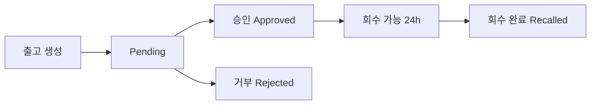

# Phase 7.3: Pending 상태 워크플로우

## 📋 Overview

**목표**: 제조사 → 유통사, 유통사 → 병원 출고 시 Pending 상태 관리 워크플로우를 구현하고, 승인/거부/회수 로직을 완성합니다.

**PRD 참조**:
- Section 8.5: 입고 수락/반품 (유통사)
- Section 9.2: 승인 대기 관리
- Section 11: 회수 (24시간 이내)

**예상 소요 시간**: 1-2일

---

## 🎯 핵심 요구사항

### 1. Pending 상태 플로우



**상태 정의**:
- `pending`: 출고 완료, 입고 대기 중
- `approved`: 입고 수락됨
- `rejected`: 입고 거부됨 (제조사/유통사 재고 복원)
- `recalled`: 24시간 이내 회수 완료

### 2. shipments 테이블 스키마

```sql
CREATE TYPE shipment_status AS ENUM ('pending', 'approved', 'rejected', 'recalled');

CREATE TABLE shipments (
  id UUID PRIMARY KEY DEFAULT uuid_generate_v4(),
  from_organization_id UUID REFERENCES organizations(id),
  to_organization_id UUID REFERENCES organizations(id),
  status shipment_status DEFAULT 'pending',
  shipped_at TIMESTAMPTZ NOT NULL DEFAULT NOW(),
  approved_at TIMESTAMPTZ,
  rejected_at TIMESTAMPTZ,
  recalled_at TIMESTAMPTZ,
  reject_reason TEXT,
  recall_reason TEXT,
  created_at TIMESTAMPTZ DEFAULT NOW(),
  updated_at TIMESTAMPTZ DEFAULT NOW()
);

CREATE INDEX idx_shipments_status ON shipments(status);
CREATE INDEX idx_shipments_to_org ON shipments(to_organization_id);
CREATE INDEX idx_shipments_shipped_at ON shipments(shipped_at);
```

---

## 🔄 워크플로우별 구현

### 1. 출고 생성 (Pending 상태)

**제조사 출고** (`Phase 3.5`):
```typescript
// src/pages/manufacturer/ShipmentPage.tsx
const handleShipment = async (distributorId: string, items: CartItem[]) => {
  // 1. Shipment 생성 (status = 'pending')
  const { data: shipment, error } = await supabase
    .from('shipments')
    .insert({
      from_organization_id: userData.organization_id,
      to_organization_id: distributorId,
      status: 'pending',
      shipped_at: new Date().toISOString(),
    })
    .select()
    .single()

  if (error) throw error

  // 2. Shipment Items 생성
  const shipmentItems = items.map(item => ({
    shipment_id: shipment.id,
    lot_id: item.lot.id,
    quantity: item.quantity,
    virtual_code: generateVirtualCode('MFR', userData.organization_id),
  }))

  await supabase.from('shipment_items').insert(shipmentItems)

  // 3. 제조사 재고 차감 (decrement_inventory 함수)
  for (const item of items) {
    await supabase.rpc('decrement_inventory', {
      p_lot_id: item.lot.id,
      p_quantity: item.quantity,
      p_organization_id: userData.organization_id,
    })
  }

  toast.success('출고가 완료되었습니다. (Pending 상태)')
}
```

**유통사 출고** (`Phase 4.3`):
- 제조사와 동일한 로직
- `from_organization_id`: 유통사
- `to_organization_id`: 병원

---

### 2. 입고 승인 (Approved)

**유통사 입고** (`Phase 4.1`):
```typescript
// src/pages/distributor/ReceivingPage.tsx
const handleApprove = async (shipmentId: string) => {
  // 1. Shipment 상태 업데이트
  const { error: shipmentError } = await supabase
    .from('shipments')
    .update({
      status: 'approved',
      approved_at: new Date().toISOString(),
    })
    .eq('id', shipmentId)

  if (shipmentError) throw shipmentError

  // 2. Shipment Items 조회
  const { data: items } = await supabase
    .from('shipment_items')
    .select('*, lot(*)')
    .eq('shipment_id', shipmentId)

  // 3. 유통사 재고 생성 (increment_inventory 함수)
  for (const item of items) {
    await supabase.from('inventory').insert({
      organization_id: userData.organization_id,
      lot_id: item.lot_id,
      current_quantity: item.quantity,
      initial_quantity: item.quantity,
      virtual_code: item.virtual_code,
    })
  }

  toast.success('입고가 승인되었습니다.')
}
```

**병원 입고** (`Phase 5.1`):
- 유통사와 동일한 로직

---

### 3. 입고 거부 (Rejected)

**유통사 입고 거부** (`Phase 4.1`):
```typescript
const handleReject = async (shipmentId: string, reason: string) => {
  // 1. Shipment 상태 업데이트
  await supabase
    .from('shipments')
    .update({
      status: 'rejected',
      rejected_at: new Date().toISOString(),
      reject_reason: reason,
    })
    .eq('id', shipmentId)

  // 2. Shipment Items 조회
  const { data: items } = await supabase
    .from('shipment_items')
    .select('*')
    .eq('shipment_id', shipmentId)

  // 3. 제조사 재고 복원 (increment_inventory 함수)
  for (const item of items) {
    await supabase.rpc('increment_inventory', {
      p_lot_id: item.lot_id,
      p_quantity: item.quantity,
      p_organization_id: shipment.from_organization_id, // 제조사
    })
  }

  toast.success('입고가 거부되었습니다. 제조사 재고가 복원되었습니다.')
}
```

---

### 4. 회수 처리 (Recalled)

**PRD 요구사항**:
- 승인 후 **24시간 이내**만 회수 가능
- 회수 시 유통사/병원 재고 차감, 제조사/유통사 재고 복원

**회수 가능 여부 확인**:

**파일**: `src/utils/shipment.ts`

```typescript
/**
 * 24시간 회수 제한 검증
 *
 * PRD 요구사항 (Section 11):
 * - 승인 후 24시간 이내만 회수 가능
 * - 타임존: UTC 기준 (서버 시간)
 * - 경계 케이스: 정확히 24:00:00일 때는 회수 불가
 *
 * @param approvedAt - 승인 타임스탬프 (ISO 8601 format, UTC)
 * @returns 회수 가능 여부
 *
 * @example
 * // 23시간 59분 경과 -> true
 * canRecall('2025-01-20T10:00:00Z') // 현재 2025-01-21T09:59:59Z
 *
 * // 정확히 24시간 경과 -> false
 * canRecall('2025-01-20T10:00:00Z') // 현재 2025-01-21T10:00:00Z
 *
 * // 24시간 1초 경과 -> false
 * canRecall('2025-01-20T10:00:00Z') // 현재 2025-01-21T10:00:01Z
 */
export function canRecall(approvedAt: string): boolean {
  // 1. UTC 시간 기준으로 파싱 (타임존 오류 방지)
  const approvedTime = new Date(approvedAt).getTime()
  const now = Date.now()

  // 2. 밀리초 단위 차이 계산
  const diffMs = now - approvedTime

  // 3. 24시간 = 86,400,000ms
  const TWENTY_FOUR_HOURS_MS = 24 * 60 * 60 * 1000

  // 4. 정확히 24시간 이상 경과 시 false (경계 케이스: 24:00:00은 불가)
  return diffMs < TWENTY_FOUR_HOURS_MS
}

/**
 * 회수 가능 시간 (남은 시간) 계산
 *
 * @param approvedAt - 승인 타임스탬프
 * @returns 남은 시간 (시간 단위, 소수점 첫째자리)
 *
 * @example
 * getHoursLeft('2025-01-20T10:00:00Z') // 현재 2025-01-20T14:30:00Z
 * // Returns: 19.5 (19시간 30분 남음)
 */
export function getHoursLeft(approvedAt: string): number {
  const approvedTime = new Date(approvedAt).getTime()
  const now = Date.now()
  const diffMs = now - approvedTime

  const TWENTY_FOUR_HOURS_MS = 24 * 60 * 60 * 1000
  const remainingMs = TWENTY_FOUR_HOURS_MS - diffMs

  // 남은 시간을 시간 단위로 변환 (소수점 첫째자리)
  const hoursLeft = Math.max(0, remainingMs / (1000 * 60 * 60))

  return Math.round(hoursLeft * 10) / 10 // 19.543 -> 19.5
}

/**
 * 회수 만료 타임스탬프 계산
 *
 * @param approvedAt - 승인 타임스탬프
 * @returns 회수 만료 타임스탬프 (ISO 8601 format)
 *
 * @example
 * getRecallDeadline('2025-01-20T10:00:00Z')
 * // Returns: '2025-01-21T10:00:00.000Z'
 */
export function getRecallDeadline(approvedAt: string): string {
  const approvedTime = new Date(approvedAt).getTime()
  const deadline = new Date(approvedTime + 24 * 60 * 60 * 1000)

  return deadline.toISOString()
}
```

**회수 처리 로직** (`Phase 4.1`, `Phase 5.1`):

**파일**: `src/pages/distributor/ReceivingPage.tsx` (유통사)

```typescript
import { canRecall, getHoursLeft } from '@/utils/shipment'
import { ERROR_MESSAGES } from '@/constants/messages'

const handleRecall = async (shipmentId: string, reason: string) => {
  try {
    // 1. Shipment 조회
    const { data: shipment, error: fetchError } = await supabase
      .from('shipments')
      .select('*, shipment_items(*)')
      .eq('id', shipmentId)
      .single()

    if (fetchError || !shipment) {
      throw new Error(ERROR_MESSAGES.SHIPMENT.NOT_FOUND)
    }

    // 2. 상태 검증: approved만 회수 가능
    if (shipment.status !== 'approved') {
      throw new Error(ERROR_MESSAGES.RECALL.NOT_APPROVED)
    }

    // 3. 24시간 제한 검증
    if (!canRecall(shipment.approved_at)) {
      const deadline = getRecallDeadline(shipment.approved_at)
      throw new Error(
        `${ERROR_MESSAGES.RECALL.TIME_EXPIRED} (만료: ${format(new Date(deadline), 'yyyy-MM-dd HH:mm:ss')})`
      )
    }

    // 4. 회수 사유 검증 (최소 5자)
    if (!reason || reason.trim().length < 5) {
      throw new Error(ERROR_MESSAGES.RECALL.REASON_REQUIRED)
    }

    // 5. Shipment 상태 업데이트
    const { error: updateError } = await supabase
      .from('shipments')
      .update({
        status: 'recalled',
        recalled_at: new Date().toISOString(),
        recall_reason: reason.trim(),
      })
      .eq('id', shipmentId)

    if (updateError) throw updateError

    // 6. 수령 조직 재고 차감 (유통사/병원)
    for (const item of shipment.shipment_items) {
      const { error } = await supabase.rpc('decrement_inventory', {
        p_lot_id: item.lot_id,
        p_quantity: item.quantity,
        p_organization_id: shipment.to_organization_id,
      })

      if (error) {
        throw new Error(
          `${ERROR_MESSAGES.RECALL.INVENTORY_DEDUCT_FAILED}: Lot ${item.lot_id}`
        )
      }
    }

    // 7. 발송 조직 재고 복원 (제조사/유통사)
    for (const item of shipment.shipment_items) {
      const { error } = await supabase.rpc('increment_inventory', {
        p_lot_id: item.lot_id,
        p_quantity: item.quantity,
        p_organization_id: shipment.from_organization_id,
      })

      if (error) {
        throw new Error(
          `${ERROR_MESSAGES.RECALL.INVENTORY_RESTORE_FAILED}: Lot ${item.lot_id}`
        )
      }
    }

    toast({
      title: SUCCESS_MESSAGES.RECALL.COMPLETED,
      description: `회수 사유: ${reason}`,
    })

    // 쿼리 갱신
    queryClient.invalidateQueries({ queryKey: ['shipments'] })
    queryClient.invalidateQueries({ queryKey: ['inventory'] })
  } catch (error) {
    toast({
      title: ERROR_MESSAGES.RECALL.FAILED,
      description: error instanceof Error ? error.message : ERROR_MESSAGES.GENERAL.UNEXPECTED,
      variant: 'destructive',
    })
    throw error
  }
}
```

**에러 메시지 정의** (`src/constants/messages.ts`):

```typescript
export const ERROR_MESSAGES = {
  // ... 기존
  SHIPMENT: {
    NOT_FOUND: '출고 정보를 찾을 수 없습니다.',
  },
  RECALL: {
    NOT_APPROVED: '승인된 출고만 회수할 수 있습니다.',
    TIME_EXPIRED: '24시간이 경과하여 회수할 수 없습니다.',
    REASON_REQUIRED: '회수 사유를 5자 이상 입력해주세요.',
    INVENTORY_DEDUCT_FAILED: '수령 조직 재고 차감 실패',
    INVENTORY_RESTORE_FAILED: '발송 조직 재고 복원 실패',
    FAILED: '회수 처리에 실패했습니다.',
  },
} as const

export const SUCCESS_MESSAGES = {
  // ... 기존
  RECALL: {
    COMPLETED: '회수가 완료되었습니다.',
  },
} as const
```

---

## 📂 UI 컴포넌트

### 1. Pending 목록 (유통사/병원)

**파일**: `src/components/PendingShipmentsTable.tsx`

```tsx
interface PendingShipmentsTableProps {
  shipments: Shipment[]
  onApprove: (id: string) => void
  onReject: (id: string, reason: string) => void
}

export function PendingShipmentsTable({ shipments, onApprove, onReject }: Props) {
  return (
    <Table>
      <TableHeader>
        <TableRow>
          <TableHead>발송 조직</TableHead>
          <TableHead>발송일</TableHead>
          <TableHead>제품 수</TableHead>
          <TableHead>상태</TableHead>
          <TableHead>Actions</TableHead>
        </TableRow>
      </TableHeader>
      <TableBody>
        {shipments.map(shipment => (
          <TableRow key={shipment.id}>
            <TableCell>{shipment.from_organization.name}</TableCell>
            <TableCell>{formatDate(shipment.shipped_at)}</TableCell>
            <TableCell>{shipment.shipment_items.length}</TableCell>
            <TableCell>
              <Badge variant="warning">Pending</Badge>
            </TableCell>
            <TableCell>
              <Button onClick={() => onApprove(shipment.id)}>승인</Button>
              <Button variant="destructive" onClick={() => handleRejectDialog(shipment.id)}>
                거부
              </Button>
            </TableCell>
          </TableRow>
        ))}
      </TableBody>
    </Table>
  )
}
```

### 2. 승인된 출고 목록 (회수 버튼 포함)

**파일**: `src/components/ApprovedShipmentsTable.tsx`

```tsx
import { useState, useEffect } from 'react'
import { canRecall, getHoursLeft, getRecallDeadline } from '@/utils/shipment'
import { format, formatDistanceToNow } from 'date-fns'
import { ko } from 'date-fns/locale'
import { Button } from '@/components/ui/button'
import { Badge } from '@/components/ui/badge'
import { Clock, AlertTriangle } from 'lucide-react'
import {
  Dialog,
  DialogContent,
  DialogHeader,
  DialogTitle,
  DialogFooter,
} from '@/components/ui/dialog'
import { Textarea } from '@/components/ui/textarea'

interface ApprovedShipmentsTableProps {
  shipments: Shipment[]
  onRecall: (id: string, reason: string) => Promise<void>
}

export function ApprovedShipmentsTable({ shipments, onRecall }: ApprovedShipmentsTableProps) {
  const [isRecallDialogOpen, setIsRecallDialogOpen] = useState(false)
  const [selectedShipmentId, setSelectedShipmentId] = useState<string>('')
  const [recallReason, setRecallReason] = useState('')
  const [currentTime, setCurrentTime] = useState(Date.now())

  // 1초마다 시간 업데이트 (실시간 카운트다운)
  useEffect(() => {
    const interval = setInterval(() => {
      setCurrentTime(Date.now())
    }, 1000)

    return () => clearInterval(interval)
  }, [])

  const handleRecallClick = (shipmentId: string) => {
    setSelectedShipmentId(shipmentId)
    setIsRecallDialogOpen(true)
    setRecallReason('')
  }

  const handleRecallSubmit = async () => {
    if (!recallReason.trim() || recallReason.trim().length < 5) {
      toast({
        title: '회수 사유를 5자 이상 입력해주세요.',
        variant: 'destructive',
      })
      return
    }

    await onRecall(selectedShipmentId, recallReason.trim())
    setIsRecallDialogOpen(false)
    setRecallReason('')
  }

  return (
    <>
      <Table>
        <TableHeader>
          <TableRow>
            <TableHead>발송 조직</TableHead>
            <TableHead>승인일</TableHead>
            <TableHead>제품 수</TableHead>
            <TableHead>회수 기한</TableHead>
            <TableHead>회수</TableHead>
          </TableRow>
        </TableHeader>
        <TableBody>
          {shipments.map((shipment) => {
            const isRecallable = canRecall(shipment.approved_at)
            const hoursLeft = getHoursLeft(shipment.approved_at)
            const deadline = getRecallDeadline(shipment.approved_at)

            return (
              <TableRow key={shipment.id}>
                <TableCell className="font-medium">
                  {shipment.from_organization.name}
                </TableCell>
                <TableCell>
                  <div className="text-sm">
                    {format(new Date(shipment.approved_at), 'yyyy-MM-dd HH:mm:ss')}
                  </div>
                  <div className="text-xs text-gray-500">
                    {formatDistanceToNow(new Date(shipment.approved_at), {
                      addSuffix: true,
                      locale: ko,
                    })}
                  </div>
                </TableCell>
                <TableCell>
                  <Badge variant="secondary">
                    {shipment.shipment_items?.length || 0}개 제품
                  </Badge>
                </TableCell>
                <TableCell>
                  {isRecallable ? (
                    <div className="flex items-center gap-2">
                      <Clock className="w-4 h-4 text-blue-600" />
                      <div>
                        <div className="text-sm font-medium text-blue-600">
                          {hoursLeft}시간 남음
                        </div>
                        <div className="text-xs text-gray-500">
                          {format(new Date(deadline), 'MM-dd HH:mm')}까지
                        </div>
                      </div>
                      {hoursLeft < 2 && (
                        <AlertTriangle className="w-4 h-4 text-yellow-600" />
                      )}
                    </div>
                  ) : (
                    <div className="flex items-center gap-2 text-gray-400">
                      <Clock className="w-4 h-4" />
                      <span className="text-sm">24시간 경과</span>
                    </div>
                  )}
                </TableCell>
                <TableCell>
                  {isRecallable ? (
                    <Button
                      variant="outline"
                      size="sm"
                      onClick={() => handleRecallClick(shipment.id)}
                      className={`${
                        hoursLeft < 2
                          ? 'border-yellow-600 text-yellow-600 hover:bg-yellow-50'
                          : ''
                      }`}
                    >
                      회수
                    </Button>
                  ) : (
                    <Button variant="ghost" size="sm" disabled>
                      회수 불가
                    </Button>
                  )}
                </TableCell>
              </TableRow>
            )
          })}
        </TableBody>
      </Table>

      {/* 회수 사유 입력 Dialog */}
      <Dialog open={isRecallDialogOpen} onOpenChange={setIsRecallDialogOpen}>
        <DialogContent>
          <DialogHeader>
            <DialogTitle>회수 사유 입력</DialogTitle>
          </DialogHeader>
          <div className="space-y-4">
            <div>
              <label className="text-sm font-medium text-gray-700">
                회수 사유 (최소 5자) *
              </label>
              <Textarea
                value={recallReason}
                onChange={(e) => setRecallReason(e.target.value)}
                placeholder="예: 제품 품질 이상으로 회수합니다."
                className="mt-1.5"
                rows={4}
                maxLength={200}
              />
              <div className="mt-1 text-xs text-gray-500">
                {recallReason.length}/200자 (최소 5자 필요)
              </div>
            </div>

            <div className="rounded-lg bg-yellow-50 border border-yellow-200 p-3">
              <div className="flex items-start gap-2">
                <AlertTriangle className="w-4 h-4 text-yellow-600 mt-0.5" />
                <div className="text-xs text-yellow-800">
                  <div className="font-semibold">회수 시 주의사항</div>
                  <ul className="mt-1 list-disc list-inside space-y-0.5">
                    <li>수령 조직의 재고가 차감됩니다.</li>
                    <li>발송 조직의 재고가 복원됩니다.</li>
                    <li>회수 후 취소할 수 없습니다.</li>
                  </ul>
                </div>
              </div>
            </div>
          </div>
          <DialogFooter>
            <Button
              variant="outline"
              onClick={() => setIsRecallDialogOpen(false)}
            >
              취소
            </Button>
            <Button
              onClick={handleRecallSubmit}
              disabled={!recallReason.trim() || recallReason.trim().length < 5}
            >
              회수 처리
            </Button>
          </DialogFooter>
        </DialogContent>
      </Dialog>
    </>
  )
}
```

**실시간 카운트다운 설명**:

1. **useEffect + setInterval**: 1초마다 `currentTime` 업데이트로 UI 자동 갱신
2. **조건부 색상**: 2시간 미만 남았을 때 노란색 경고 표시
3. **자동 비활성화**: 24시간 경과 시 버튼 자동 `disabled`
4. **한국어 상대 시간**: "12시간 전", "3시간 전" 등 표시 (date-fns/locale/ko)
5. **회수 사유 검증**: 최소 5자 입력 필요, 200자 제한

---

## 🧪 테스트 시나리오

### 시나리오 1: Pending 생성 및 승인

**Given**:
- 제조사가 유통사에 제품 출고

**When**:
- 유통사가 Pending 목록에서 해당 출고 확인
- "승인" 버튼 클릭

**Then**:
- Shipment status: `pending` → `approved`
- 유통사 재고에 제품 추가
- `approved_at` 타임스탬프 기록

---

### 시나리오 2: Pending 거부

**Given**:
- 제조사가 유통사에 제품 출고

**When**:
- 유통사가 "거부" 클릭하고 사유 입력

**Then**:
- Shipment status: `pending` → `rejected`
- 제조사 재고 복원
- `reject_reason` 저장

---

### 시나리오 3: 24시간 이내 회수

**Given**:
- 유통사가 출고를 승인 (12시간 전)

**When**:
- "회수" 버튼 클릭

**Then**:
- Shipment status: `approved` → `recalled`
- 유통사 재고 차감
- 제조사 재고 복원
- `recalled_at` 타임스탬프 기록

---

### 시나리오 4: 24시간 경과 후 회수 불가

**Given**:
- 유통사가 출고를 승인 (25시간 전)

**When**:
- "회수" 버튼 확인

**Then**:
- 회수 버튼 비활성화
- "회수 불가 (24h 경과)" 텍스트 표시

---

## ✅ Definition of Done

### 데이터베이스
- [ ] `shipment_status` ENUM 타입 생성
- [ ] `shipments` 테이블 스키마 확인 및 컬럼 추가
- [ ] 인덱스 생성 (status, to_organization_id, shipped_at)

### 코드 구현
- [ ] Phase 3.5: 제조사 출고 시 Pending 생성
- [ ] Phase 4.1: 유통사 입고 승인/거부/회수 로직
- [ ] Phase 4.3: 유통사 출고 시 Pending 생성
- [ ] Phase 5.1: 병원 입고 승인/거부/회수 로직
- [ ] `canRecall` 헬퍼 함수 구현 (`src/utils/shipment.ts`)
- [ ] `getHoursLeft` 헬퍼 함수 구현

### UI 컴포넌트
- [ ] `PendingShipmentsTable.tsx` 생성
- [ ] `ApprovedShipmentsTable.tsx` 생성
- [ ] 거부 사유 입력 Dialog
- [ ] 회수 사유 입력 Dialog
- [ ] 24시간 카운트다운 표시

### 테스트
- [ ] 4개 시나리오 모두 E2E 테스트 통과
- [ ] 거부 시 재고 복원 확인
- [ ] 회수 시 재고 복원 확인
- [ ] 24시간 초과 시 회수 불가 확인

### 문서화
- [ ] Pending 워크플로우 다이어그램 작성
- [ ] 상태 전이표 문서화
- [ ] PRD Section 8.5, 9.2, 11 요구사항 충족 확인

---

## 🔗 관련 문서

- [Phase 3.5: 제조사 출고](../phase-3/phase-3.5-shipment.md)
- [Phase 4.1: 유통사 입고](../phase-4/phase-4.1-receiving.md)
- [Phase 4.3: 병원 출고](../phase-4/phase-4.3-hospital-shipment.md)
- [Phase 5.1: 병원 입고](../phase-5/phase-5.1-hospital-receiving.md)
- [PRD Section 8.5: 입고 수락/반품](../../neo-cert-prd-1.2.md#85-입고-수락반품)
- [PRD Section 11: 회수](../../neo-cert-prd-1.2.md#11-회수)

---

## ⏭️ Next Steps

**다음 단계**: [Phase 7.4 - 동시성 처리 (락 메커니즘)](phase-7.4-concurrency.md)
